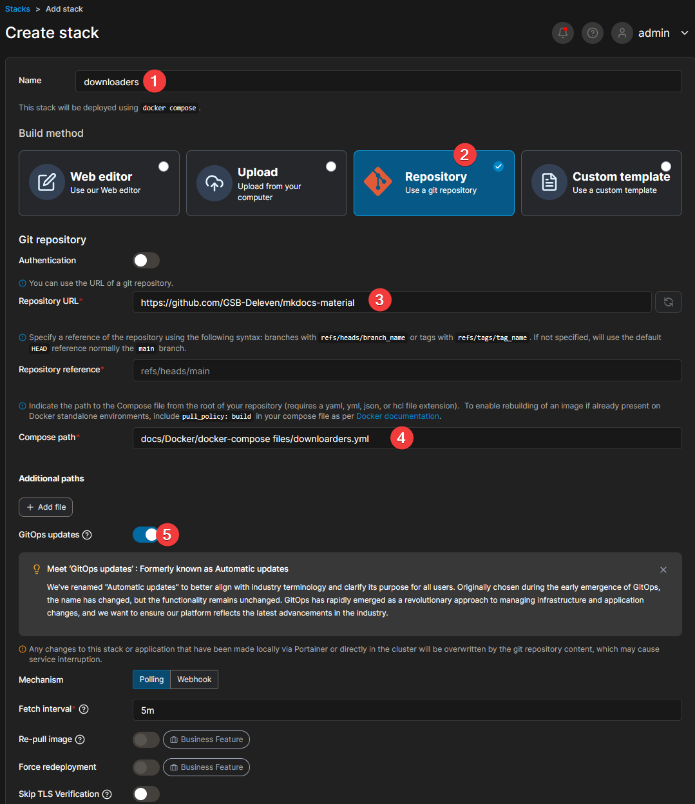
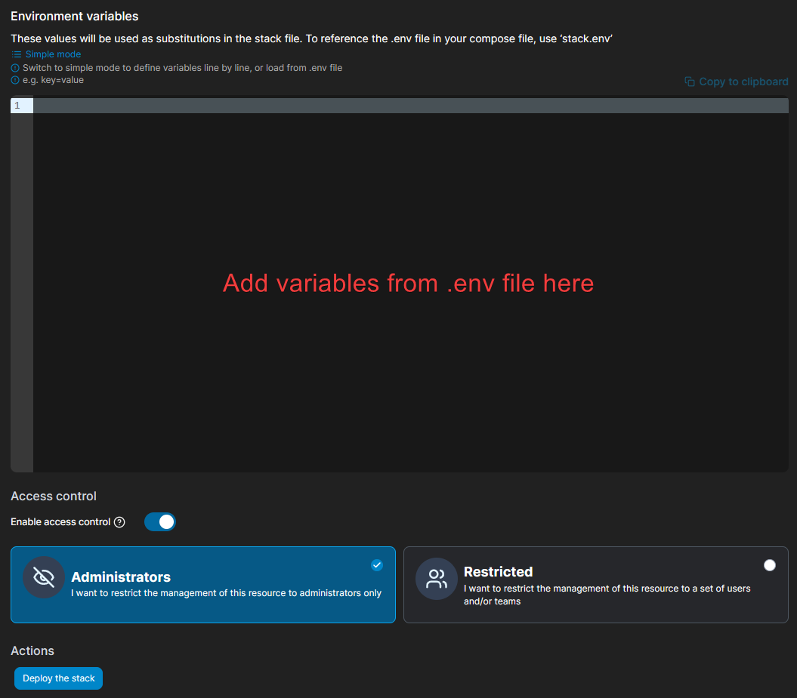

icon: simple/octopusdeploy
# [:simple-github: Stacks](https://github.com/GSB-Deleven/mkdocs-material/tree/9a17719447ba52e67c076483c3ad040b0fc4fae6/docs/Docker/docker-compose%20files)

All [:simple-github: Portainer Stacks](https://github.com/GSB-Deleven/mkdocs-material/tree/main/docs/Docker/docker-compose%20files) are directly linked to [:simple-github: GitHub](https://github.com/GSB-Deleven/mkdocs-material/tree/main/docs/Docker/docker-compose%20files), so if i update them on [:simple-github: GitHub](https://github.com/GSB-Deleven/mkdocs-material/tree/main/docs/Docker/docker-compose%20files), 5min Later, they will be Updated in [:simple-portainer: Portainer](Portainer/portainer.md)



---
<!-- ##################################################### Arr-Stack ################################################################ -->

## [:simple-github: Arr-Stack](https://github.com/GSB-Deleven/mkdocs-material/blob/9a17719447ba52e67c076483c3ad040b0fc4fae6/docs/Docker/docker-compose%20files/arr-stack.yml)

includes

[{ width="80" }](https://hub.docker.com/r/linuxserver/radarr)  
{ width="20" } [Sonarr](https://hub.docker.com/r/linuxserver/sonarr)  
{ width="20" } [Lidarr](https://docs.linuxserver.io/images/docker-lidarr/)  
{ width="20" } [Readarr](https://hotio.dev/containers/readarr/)  
{ width="20" } [Porwlarr](https://hub.docker.com/r/linuxserver/prowlarr)  
{ width="20" } [Audiobook Shelf](https://www.audiobookshelf.org/docs/)  

```yaml title="arr-stack.yml" linenums="1"
--8<-- "Docker/docker-compose files/arr-stack.yml"
```

---
<!-- ##################################################### Cloudflare DDNS Updater ################################################################ -->

## [:simple-github: Cloudflare DDNS Updater](https://github.com/GSB-Deleven/mkdocs-material/blob/9a17719447ba52e67c076483c3ad040b0fc4fae6/docs/Docker/docker-compose%20files/cloudflare.yml)

includes

{ width="20" } [Cloudflare DDNS Updater](https://github.com/favonia/cloudflare-ddns)

```yaml title="cloudflare.yml" linenums="1"
--8<-- "Docker/docker-compose files/cloudflare.yml"
```

---
<!-- ##################################################### COMICS ################################################################ -->

## [:simple-github: Comics](https://github.com/GSB-Deleven/mkdocs-material/blob/41b29178b174ad96cba983affc276baf999510d9/docs/Docker/docker-compose%20files/comics.yml)

includes

{ width="20" } [Mylar3](https://hub.docker.com/r/linuxserver/mylar3) (commented out, as it is not needed currently)  
{ width="20" } [Komga](https://github.com/gotson/komga)  
{ width="20" } [Kavita](https://hub.docker.com/r/jvmilazz0/kavita)  

```yaml title="comics.yml" linenums="1"
--8<-- "Docker/docker-compose files/comics.yml"
```

---
<!-- ##################################################### DOWNLOADERS ################################################################ -->

## [:simple-github: Downloaders](https://github.com/GSB-Deleven/mkdocs-material/blob/41b29178b174ad96cba983affc276baf999510d9/docs/Docker/docker-compose%20files/downloarders.yml)

includes

[{ width="80" }](https://docs.linuxserver.io/images/docker-sabnzbd/)

```yaml title="downloaders.yml" linenums="1"
--8<-- "Docker/docker-compose files/downloaders.yml"
```

---
<!-- ##################################################### MEMOS ################################################################ -->

## [:simple-github: Memos](https://github.com/GSB-Deleven/mkdocs-material/blob/945df56446b6183f1394248a754b6b5ad0477a06/docs/Docker/docker-compose%20files/memos.yml)

includes

[{ width="80" }](https://github.com/usememos/memos)

```yaml title="memos.yml" linenums="1"
--8<-- "Docker/docker-compose files/memos.yml"
```

---
<!-- ##################################################### NEXTCLOUD ################################################################ -->

## [:simple-github: Nextcloud](https://github.com/GSB-Deleven/mkdocs-material/blob/945df56446b6183f1394248a754b6b5ad0477a06/docs/Docker/docker-compose%20files/nextcloud.yml)

includes

[{ width="80" }](https://hub.docker.com/_/nextcloud) 

```yaml title="nextcloud.yml" linenums="1"
--8<-- "Docker/docker-compose files/nextcloud.yml"
```

---
<!-- ##################################################### PLEX STACK ################################################################ -->

## [:simple-github: Plex Stack](https://github.com/GSB-Deleven/mkdocs-material/blob/945df56446b6183f1394248a754b6b5ad0477a06/docs/Docker/docker-compose%20files/plex-stack.yml)

includes

[{ width="80" }](https://docs.linuxserver.io/images/docker-plex/)  
[{ width="20" }](https://docs.linuxserver.io/images/docker-tautulli/) [Tautulli](https://docs.linuxserver.io/images/docker-tautulli/)  
[{ width="20" }](https://docs.linuxserver.io/images/docker-overseerr/) [Overseerr](https://docs.linuxserver.io/images/docker-overseerr/)  


```yaml title="plex-stack.yml" linenums="1"
--8<-- "Docker/docker-compose files/plex-stack.yml"
```

---
<!-- ##################################################### UPTIME KUMA ################################################################ -->

## [:simple-github: Uptime Kuma](https://github.com/GSB-Deleven/mkdocs-material/blob/945df56446b6183f1394248a754b6b5ad0477a06/docs/Docker/docker-compose%20files/uptimekuma.yml)

includes

{ width="20" } [Uptime Kuma](https://github.com/louislam/uptime-kuma)

```yaml title="uptimekuma.yml" linenums="1"
--8<-- "Docker/docker-compose files/uptimekuma.yml"
```

---
<!-- ##################################################### VAULTWARDEN ################################################################ -->

## [:simple-github: Vaultwarden](https://github.com/GSB-Deleven/mkdocs-material/blob/945df56446b6183f1394248a754b6b5ad0477a06/docs/Docker/docker-compose%20files/vaultwarden.yml)

includes

{ width="20" } [Vaultwarden](https://github.com/dani-garcia/vaultwarden)

```yaml title="vaultwarden.yml" linenums="1"
--8<-- "Docker/docker-compose files/vaultwarden.yml"
```

---