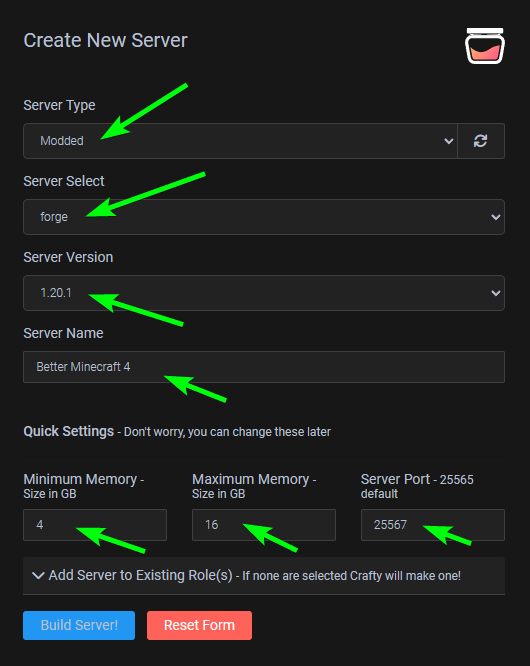
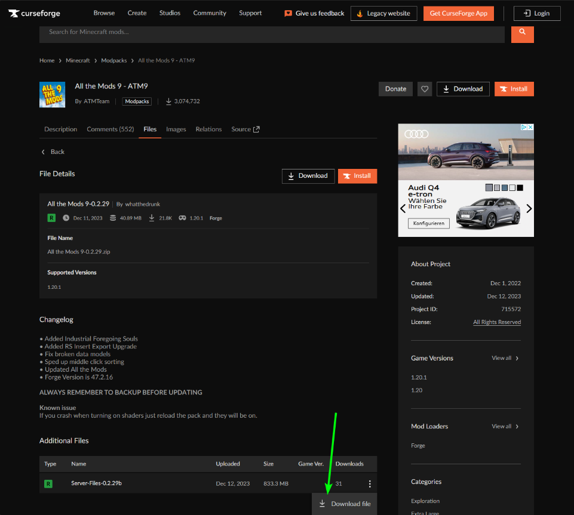
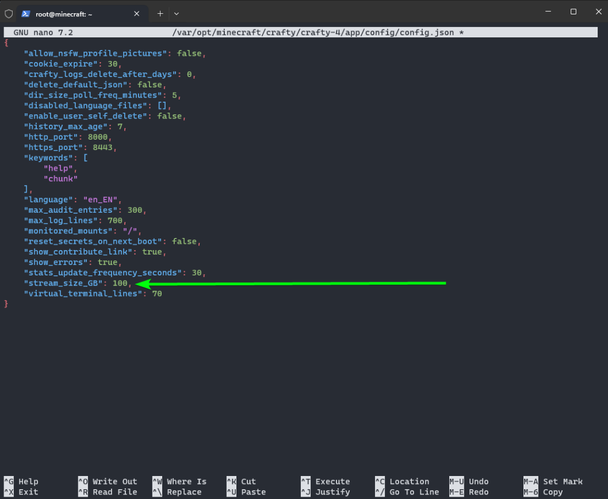
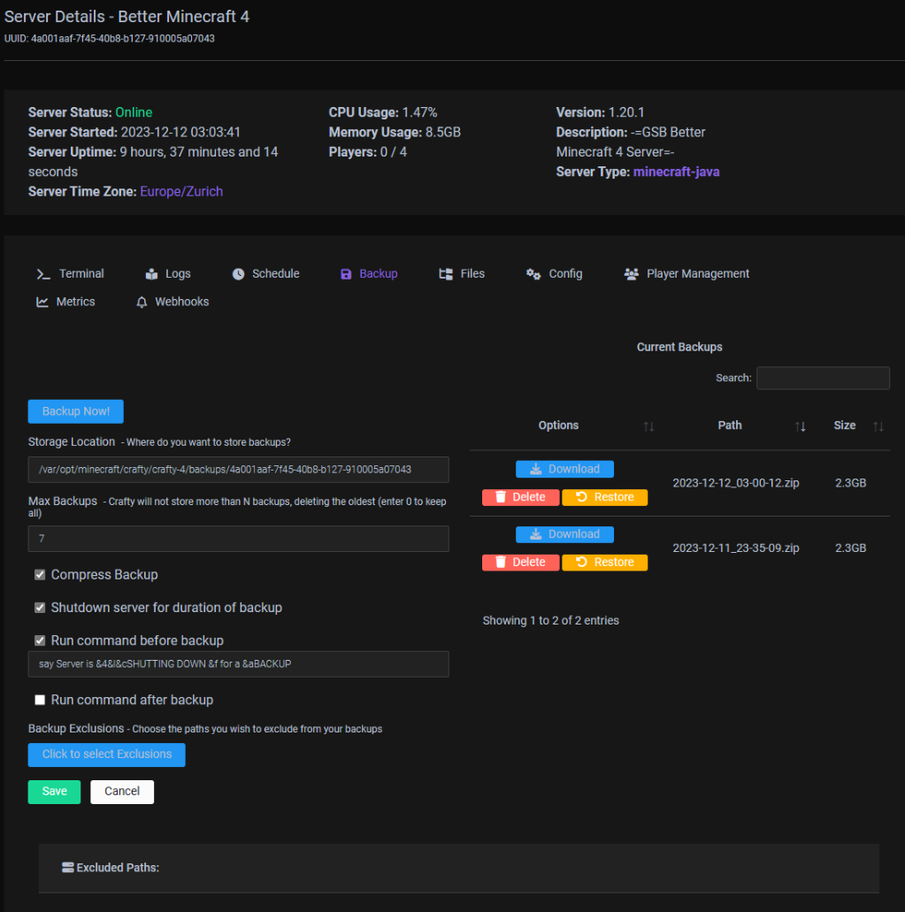
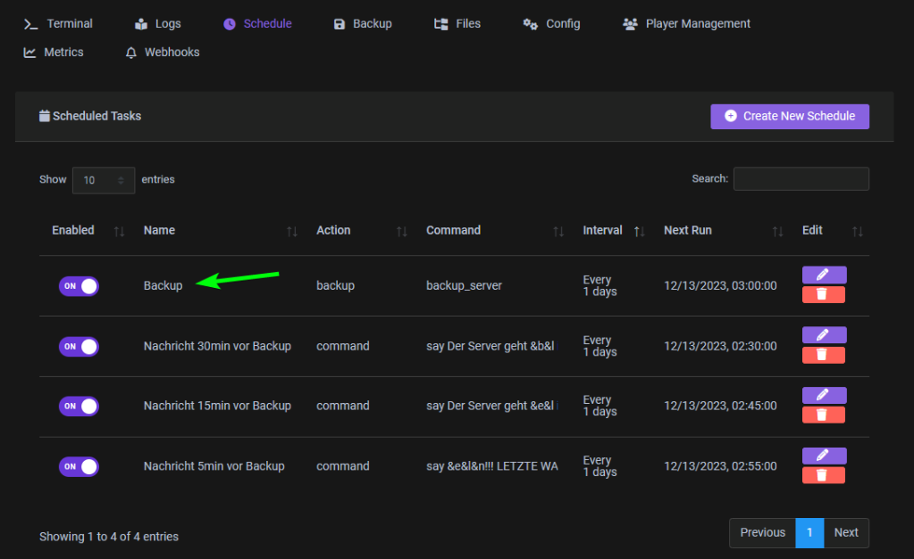

icon: material/server
# Server Setup

## Serverstatus

All the Mods 9     

  
  
Better Minecraft 4  


<iframe src="https://crafty.deleven.net/status" width="100%" height="420"></iframe>


## Install and Setup Crafty Controller 4 (on Proxmox LXC)

1. My Server runs on a [Proxmox Ubuntu LXC Container](../../Proxmox/proxmox.md)

2. Install **[Crafty Controller 4](https://docs.craftycontrol.com/)** according to [the official Guide](https://docs.craftycontrol.com/pages/getting-started/installation/linux/)

### Here is the TLDR Version of this Guide

* #### Automated Install Script (Quick)

	Please ensure your distro's packages are up-to-date and Git is present before installing Crafty:
	
	````yaml
	sudo apt update && sudo apt upgrade && sudo apt install git
	````

	One line installer

    ```yaml
    git clone https://gitlab.com/crafty-controller/crafty-installer-4.0.git && \ 
    cd crafty-installer-4.0 && \ 
    sudo ./install_crafty.sh
	```

	Once installation is complete to run Crafty manually run the following. Note that if you used a directory other then the default to install Crafty you will need to cd into that directory.

	````yaml
	sudo su crafty
	````

	````yaml
	cd /var/opt/minecraft/crafty
	````

	````yaml
	./run_crafty.sh
	````

	!!! info
		If you said yes to adding a service file you may run the following to start Crafty
		```
		sudo systemctl start crafty`
		```

		If you added a service file and want to have Crafty start automatically on system boot please run the following:

		```
		sudo systemctl enable crafty`
		```


3. now you should be able to access the Crafty Controller via `https://YOUR_SERVER_IP:8443`

	!!! example "Default Login"
		Username: `admin`  
		Password: `crafty`


## Create your Servers in Crafty Controller 4

* I used [this Guide](https://www.youtube.com/watch?v=hrIDMx4Leng) to create my Better MineCraft 4 Server
  	* Basically it is this
    	* Create a Forge Server
      * Fill out all the necessary details
      * 
      	- [x] Modded
        - [x] forge
        - [x] Server Version (Check the one needed from you [Modpack](https://www.curseforge.com/minecraft/modpacks/better-mc-forge-bmc4))
        - [x] Set the Memory (4/16 seems to work just fine)
        - [x] Set the Server Port
        - [x] Build Server!
    * Download the Modpack you want from [Curse-Forge](https://www.curseforge.com/minecraft/search?page=1&pageSize=20&sortType=2&class=modpacks) make sure download the `Server Pack`, not the regular one
    	
    * Upload the ZIP File
        	* 

		!!! tip

			you might run in to the issue that it isnt uploading, that means you need to adjust the streamsize in here to 10GB or 100GB (if it is bigger the 1GB):
			```title="location of config.json"
			sudo nano /var/opt/minecraft/crafty/crafty-4/app/config/config.json
			```
		


		!!! danger "If it didn't work"

			If this didn't worked you can also use [WinSCP](https://winscp.net/eng/download.php).  
			For this to work, you need to be able to login as `crafty` user, **otherwise the permissions don't work**  
			Login via SSH as `root`, then type:
			```
				sudo passwd crafty
			```
			set a new password and use this to login to WinSCP
			
			After this, you can just add the ==unzipped== files from the downloaded server `.zip` file to the server directly  
			(not the .zip folder, just the files in the folder)  
			If it askes you if it should override the data, you can say `yes`


    * when it autorefreshed and for that matter uploaded, Rightclick to extract
    * Adjust the `server.properties`, `whitelist.json` and `ops.json` (or do it ingame afterwords)
    	* my default [server.properties (:simple-github: Link)](https://github.com/GSB-Deleven/mkdocs-material/blob/f553e9ed95267758aae6566f9ce995e04a6e18e0/docs/Minecraft/server.properties) are

    ```properties title="server.properties" linenums="1" hl_lines="7 14 18 25 26 32 36 47 48 53 57 58"
    --8<-- "server.properties"
    ```

    * Adjust the `configs` with the right 
      * `IP`
      * `Port`
      * `Autostart`
      * `Crash Detection` and 
      * `Show on Public Status Page` toggle
  	
    
	* Go to Backups and set, how the Server gets backed up and how many Backups it keeps
    
		
    
	* and then Sheduale a Backup (i also added some Warning Messages before)
    
		

	!!! warning
		Make sure you have the proper [server.properties (:simple-github: Link)](https://github.com/GSB-Deleven/mkdocs-material/blob/f553e9ed95267758aae6566f9ce995e04a6e18e0/docs/Minecraft/server.properties) added before you start your server.  
		If the IP in this file *(most of the times it should be `server-ip=192.168.X.X`)* is not set correctly definied, it throws an error and won't start the server.

    * Now go to the Terminal in Crafty Control, add your player to the whitelist with `whitelist add <Playername>` and Start the Server 

## Make Server Accessible from outside

* [Cloudflare DDNS Updater](https://github.com/favonia/cloudflare-ddns) (Docker)
		```yaml title="My current docker-compose.yaml"
		version: "3"
		services:
		cloudflare-ddns-updater:
			image: favonia/cloudflare-ddns:latest
			network_mode: host
			cap_add:
			- SETUID # Leave this alone, as is
			- SETGID # Leave this alone, as is
			cap_drop:
			- all
			read_only: true
			security_opt:
			- no-new-privileges:true
			environment:
			- PUID=1000
			- PGID=1000
			- CF_API_TOKEN=${CF_API_TOKEN} # (1)!
			- DOMAINS=${DOMAINS} # (2)!
			- PROXIED=true
			- IP6_PROVIDER=none
			restart: unless-stopped
		```

	1. The value of `CF_API_TOKEN` should be an API token (not an API key), which can be obtained from the [API Tokens page](https://dash.cloudflare.com/profile/api-tokens).  
	Use the `Edit zone DNS` template to create and copy a token into the environment file.  
	(The less secure API key authentication is deliberately not supported.)
	2. Example:  
	```yaml
	yourdomain.com, *.yourdomain.com`   
	```
	or in the .env file  
	```yaml
	DOMAINS=yourdomain.com, *.yourdomain.com
	```

* This will then create the `A-Record` for you and keeps it up to date
	

* `CNAME` bmc (Proxied)
	
* `SRV` 
	
