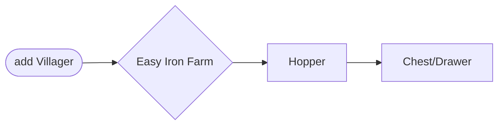
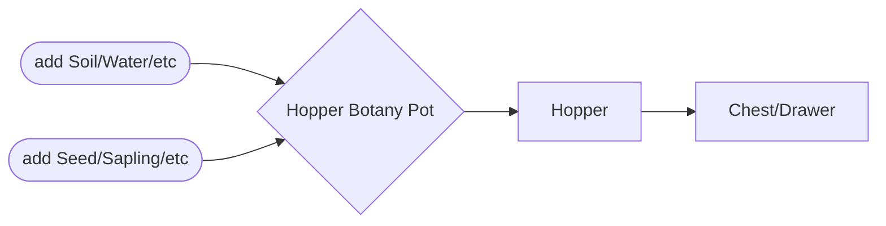
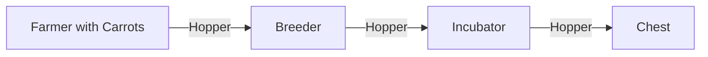
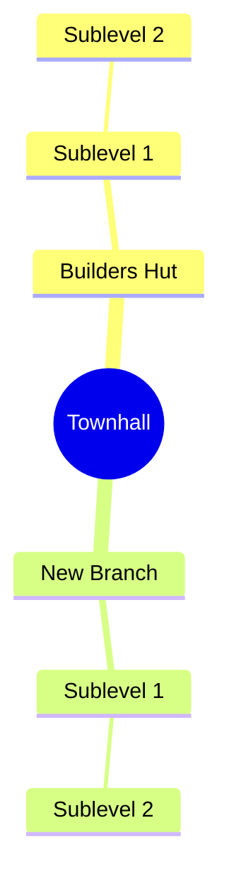

icon: material/minecraft
# All The Mods 9

## Getting Started

### Server

* Give more Forceload Chunks (+ CLaim Chunks) and make forceloaded Chunks available while offline
    * change `world/serverconfig/ftbchunks-world.snbt` to this
        * disable_protection: true
        * force_load_mode: "always"
        * max_claimed_chunks: 500
        * max_force_loaded_chunks: 25
        * pvp_mode: "never"
  	


```yaml title="world/serverconfig/ftbchunks-world.snbt" linenums="1" hl_lines="17 35 62 68 114"
  {
	# Forced modes won't let players change their ally settings
	# Default: "default"
	# Valid values: "default", "forced_all", "forced_none"
	ally_mode: "default"
	
	# Dimension ID's where chunks may not be claimed. Add "minecraft:the_end" to this list if you want to disable chunk claiming in The End, or "othermod:*" to disable chunk claiming in *all* dimensions added by "othermod"
	# Default: []
	claim_dimension_blacklist: [ ]
	
	# Dimension ID's where chunks may be claimed. If non-empty, chunks may be claimed *only* in these dimensions (and the dimension is not in "claim_dimension_blacklist"). Same syntax as for "claim_dimension_blacklist".
	# Default: []
	claim_dimension_whitelist: [ ]
	
	# Disables all land protection. Useful for private servers where everyone is trusted and claims are only used for force-loading
	# Default: false
	disable_protection: true
	
	# Override to disable/enable fake players like miners and auto-clickers globally.
	# Default will check this setting for each team
	# Default: "check"
	# Valid values: "check", "deny", "allow"
	fake_players: "check"
	
	# Minimap for clients connecting to this server will be disabled
	# Default: false
	force_disable_minimap: false
	
	# Control how force-loaded chunks work.
	# NEVER: only allow chunk force-loading if the owning team has at least one online player.
	# ALWAYS: always allow force-loading, even if no players are online.
	# DEFAULT: allow force-loading IF the team has at least one player with the 'ftbchunks.chunk_load_offline' FTB Ranks permission.
	# Default: "default"
	# Valid values: "default", "always", "never"
	force_load_mode: "always"
	
	# Hard limit for the number of chunks a team can claim, regardless of how many members. Default of 0 means no hard limit.
	# Default: 0
	# Range: 0 ~ 2147483647
	hard_team_claim_limit: 0
	
	# Hard limit for the number of chunks a team can force-load, regardless of how many members. Default of 0 means no hard limit.
	# Default: 0
	# Range: 0 ~ 2147483647
	hard_team_force_limit: 0
	
	# If true, "Location Visibility" team settings are ignored, and all players can see each other anywhere on the map.
	# Default: false
	location_mode_override: false
	
	# Interval in ticks to send updates to clients with long-range player tracking data.
	# Lower values mean more frequent updates but more server load and network traffic; be careful with this, especially on busy servers.
	# Setting this to 0 disables long-range tracking.
	# Default: 20
	# Range: 0 ~ 2147483647
	long_range_tracker_interval: 20
	
	# Max claimed chunks.
	# You can override this with FTB Ranks 'ftbchunks.max_claimed' permission
	# Default: 500
	# Range: -∞ ~ +∞
	max_claimed_chunks: 5000
	
	# Max force loaded chunks.
	# You can override this with FTB Ranks 'ftbchunks.max_force_loaded' permission
	# Default: 25
	# Range: -∞ ~ +∞
	max_force_loaded_chunks: 250
	
	# Maximum time (in real-world days) where if no player in a team logs in, the team automatically loses their claims.
	# Prevents chunks being claimed indefinitely by teams who no longer play.
	# Default of 0 means no automatic loss of claims.
	# Default: 0.0
	# Range: 0.0 ~ 3650.0
	max_idle_days_before_unclaim: 0.0d
	
	# Maximum time (in real-world days) where if no player in a team logs in, any forceloaded chunks owned by the team are no longer forceloaded.
	# Prevents chunks being forceloaded indefinitely by teams who no longer play.
	# Default of 0 means no automatic loss of forceloading.
	# Default: 0.0
	# Range: 0.0 ~ 3650.0
	max_idle_days_before_unforce: 0.0d
	
	# Maximum time in days to keep logs of prevented fakeplayer access to a team's claims.
	# Default: 7
	# Range: 1 ~ 2147483647
	max_prevented_log_age: 7
	
	# Requires you to claim chunks in order to edit and interact with blocks
	# Default: false
	no_wilderness: false
	
	# Dimension ID's where the no_wilderness rule is enforced - building is only allowed in claimed chunks. If this is non-empty, it overrides the 'no_wilderness' setting.
	# Default: []
	no_wilderness_dimensions: [ ]
	
	# Method by which party claim & force-load limits are calculated.
	# LARGEST: use the limits of the member with the largest limits
	# SUM: add up all the members' limits
	# OWNER: use the party owner's limits only
	# AVERAGE: use the average of all members' limits.
	# Default: "largest"
	# Valid values: "largest", "owner", "sum", "average"
	party_limit_mode: "largest"
	
	# When true, standard FTB Chunk explosion protection is applied in protected chunks when the source of the explosion cannot be determined
	# (Ghast fireballs are a common case - vanilla supplies a null entity source)
	# Default: true
	protect_unknown_explosions: true
	
	# Should PvP combat be allowed in claimed chunks? Default is ALWAYS; NEVER prevents it in all claimed chunks; PER_TEAM allows teams to decide if PvP is allowed in their claims
	# Default: "always"
	# Valid values: "always", "never", "per_team"
	pvp_mode: "never"
	
	# If true, the player must have the 'ftbchunks_mapping' Game stage to be able to use the map and minimap.
	# Requires KubeJS and/or Gamestages to be installed.
	# Default: false
	require_game_stage: false
}
```

### Multiplayer

* Join a `team`

### General

#### FTB UltiMine 
Use and remap `FTB UltiMine` Hotkey

#### Create a [`Backpack`](https://www.minecraft-guides.com/mod/sophisticated-backpacks/) 
[](https://www.minecraft-guides.com/mod/sophisticated-backpacks/)
[](https://www.minecraft-guides.com/mod/sophisticated-backpacks/)

#### Make use of this commands
    * `/sethome` and `/home`
    * `/rtp` (random teleport)

#### [Create easy Farms ](https://www.minecraft-guides.com/mod/easy-villagers/)

##### [Ironfarm](https://www.minecraft-guides.com/mod/easy-villagers/)



[](https://www.minecraft-guides.com/mod/easy-villagers/)

[](https://www.youtube.com/watch?v=dIVxgOliAyQ)


##### [Hopper Botany Pots Farms](https://www.youtube.com/watch?v=JU4LVv10VMw)

[](https://www.youtube.com/watch?v=JU4LVv10VMw)




  * [x] Saplings/Wood
  * [x] Wheat/Seeds
  * [x] Carrots
  * [x] Potatoes
  * [x] Sugarcane
  * [x] Rice (Needs `Waterbucker` as soil)
  * [ ] etc.
   
##### [Villager Farm (AutoBreeder)](https://www.minecraft-guides.com/mod/easy-villagers/)

[](https://www.youtube.com/watch?v=dIVxgOliAyQ)




  * `chunkload` **Farms** so they always work, even while offline if the settings are right


---


### MineColonies

* Tipps https://youtu.be/v2zLNFeX-X4?si=gCd1woN4cqJ29UBM

* build `Supplycamp/Supplyship` as starter Base (only needs 5 Chests or 5 Boats)
    * it will give you a place to Sleep
    * Starting Material
    * Townhall Block to start the Colony
* Build the [`Townhall`](https://wiki.minecolonies.ldtteam.com/source/buildings/townhall)
* Build the [`Builders Hut`](https://wiki.minecolonies.ldtteam.com/source/buildings/builder)
* Build 1-4 [`Guard Towers`](https://wiki.minecolonies.ldtteam.com/source/buildings/guardtower) and other defense `Buildings`
* Build `Storage System` and or [`Warehouse`](https://wiki.minecolonies.ldtteam.com/source/buildings/warehouse)
* Build `Builders Hut`
* Build Forrest Dude
* Build `Mine`
* Build `Farms` and add Farm buildings like [`Farm`](https://wiki.minecolonies.ldtteam.com/source/buildings/farm)
* Build [`Tavern`](https://wiki.minecolonies.ldtteam.com/source/buildings/tavern)

* 



