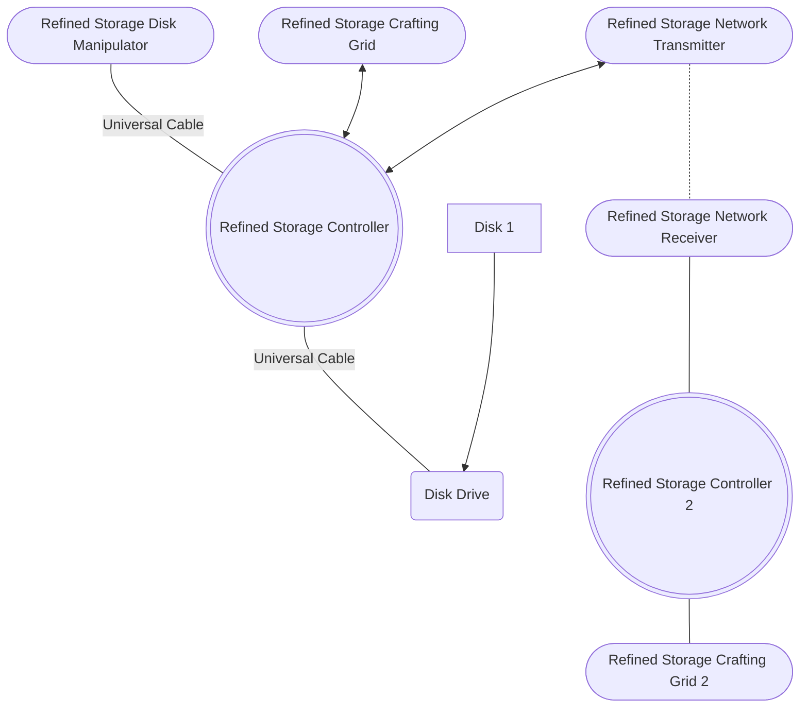
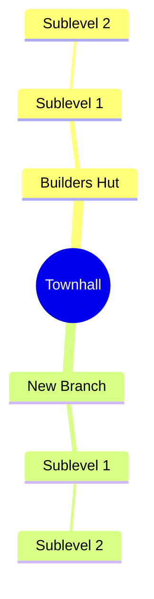

icon: material/minecraft
# All The Mods 9

## Getting Started

### Multiplayer

* Join a `team`

### General

#### FTB UltiMine 
Use and remap [`FTB UltiMine`](https://www.curseforge.com/minecraft/mc-mods/ftb-ultimine-forge) Hotkey

---

#### Create a [`Backpack`](https://www.minecraft-guides.com/mod/sophisticated-backpacks/) 

??? guide "Recipe & Guide"

	[](https://www.minecraft-guides.com/mod/sophisticated-backpacks/)
	[](https://www.minecraft-guides.com/mod/sophisticated-backpacks/)

---

#### Make use of this commands
  * `/sethome` and `/home`
  * `/rtp` (random teleport)

---

#### [Create easy Farms ](https://www.minecraft-guides.com/mod/easy-villagers/)

##### [Ironfarm](https://www.minecraft-guides.com/mod/easy-villagers/)

??? guide "Recipe & Guide"

	``` mermaid
	flowchart LR
	1([add Villager]) --> IF{Easy Iron Farm}
	IF --> H[Hopper]
	H --> Chest/Drawer
	```

	[](https://www.minecraft-guides.com/mod/easy-villagers/)

	[](https://www.youtube.com/watch?v=dIVxgOliAyQ)


##### [Hopper Botany Pots Farms](https://www.youtube.com/watch?v=JU4LVv10VMw)

??? guide "Guide"

	[](https://www.youtube.com/watch?v=JU4LVv10VMw)


	``` mermaid
	flowchart LR
	1([add Soil/Water/etc]) --> HBP{Hopper Botany Pot}
	2([add Seed/Sapling/etc]) --> HBP
	HBP --> H[Hopper]
	H --> C[Chest/Drawer]
	```

	* [x] Saplings/Wood
	* [x] Wheat/Seeds
	* [x] Carrots
	* [x] Potatoes
	* [x] Sugarcane
	* [x] Rice (Needs `Waterbucker` as soil)
	* [ ] etc.
   
##### [Villager Farm (AutoBreeder)](https://www.minecraft-guides.com/mod/easy-villagers/)

??? guide "Recipe & Guide"

	[](https://www.youtube.com/watch?v=dIVxgOliAyQ)

	``` mermaid
	flowchart LR
	Farmer[Farmer with Carrots] -->|Hopper| Breeder
	Breeder -->|Hopper| Incubator
	Incubator -->|Hopper| Chest
	```

!!! warning

    * `chunkload` **Farms** so they always work, even while offline if the settings are right

---

#### Create Storage System

??? guide "Guide"



	* Create Energy
		* Heat Generator (powah?)
	* Create Battery
		* Energy Cube (powah?)
	* Controller + Grid
		* Sophisticated Storage
		* Refined Storage
		* RFtoolsstorage
	* Functional Storage
	* Drawer System
		* Connect to Contrrollers and Grids
	* Disk Drive
		* Disks

#### Create Jetpack
* Create `Player Transmitter` *(Powah)*


---


### MineColonies

* Tipps https://youtu.be/v2zLNFeX-X4?si=gCd1woN4cqJ29UBM

* build `Supplycamp/Supplyship` as starter Base (only needs 5 Chests or 5 Boats)
    * it will give you a place to Sleep
    * Starting Material
    * Townhall Block to start the Colony
* Build the [`Townhall`](https://wiki.minecolonies.ldtteam.com/source/buildings/townhall)
* Build the [`Builders Hut`](https://wiki.minecolonies.ldtteam.com/source/buildings/builder)
* Build 1-4 [`Guard Towers`](https://wiki.minecolonies.ldtteam.com/source/buildings/guardtower) and other defense `Buildings`
* Build `Storage System` and or [`Warehouse`](https://wiki.minecolonies.ldtteam.com/source/buildings/warehouse)
* Build `Builders Hut`
* Build Forrest Dude
* Build `Mine`
* Build `Farms` and add Farm buildings like [`Farm`](https://wiki.minecolonies.ldtteam.com/source/buildings/farm)
* Build [`Tavern`](https://wiki.minecolonies.ldtteam.com/source/buildings/tavern)

* 



