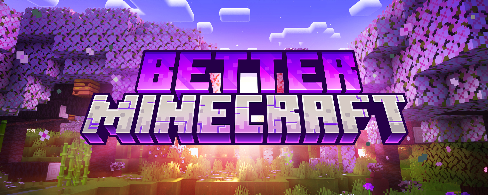

icon: material/minecraft
# Better Minecraft 4

## General Info

### Modpack 
[Better Minecraft 4 [FORGE]](https://www.curseforge.com/minecraft/modpacks/better-mc-forge-bmc4)  
[](https://www.curseforge.com/minecraft/modpacks/better-mc-forge-bmc4)


### [Server Map](https://map.deleven.net/) 
map.deleven.net

<div class="map">
  <iframe height="800" width="100%" src="https://map.deleven.net/"></iframe>
</div>

#### Seed
```
393358025
```

### ToDo
- [ ] Find Stronghold (Maybe Whitch City?)
- [ ] [Make a trashcan](https://www.youtube.com/watch?v=LkEwPOo2EFA)
- [ ] Woodland Massions raids
- [ ] Add additional Farms
    - [ ] XP-Farm / [Spawner Farm](https://www.youtube.com/watch?v=NkZtB-84A-w)
    - [ ] Gunpowder
    - [ ] Slime 
    - [ ] Bamboo- or Kelpfarm for Fuel
    - [ ] [Chicken XP Farm](https://www.youtube.com/watch?v=ou9sJNL94vU)
    - [x] [AFK Fish Farm](https://www.youtube.com/watch?v=3laAVCTmE1A)
 
        !!! tip

            for java players just hold right click and hit ++f3++ + ++t++ it will reset your textures and keep your right click
- [ ] Explore
    - [ ] Nether
    - [ ] End
    - [ ] Aether
    - [ ] Everdawn
    - [ ] Everbright
    - [ ] other Dimensione