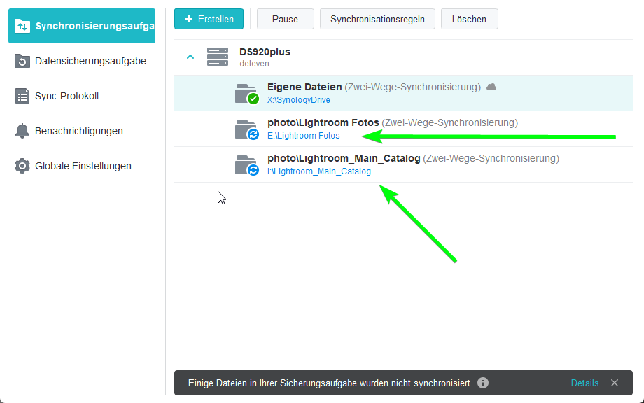

icon: material/backup-restore

# Backup Strategy

---

---

1. `CFexpress/XQD/SD Card ` -> `SSD` (on Site Backup)
2. Import to `Lightroom Classic` when back, this will add the Pictures to the HDD

!!! tip
    For a non-clientwork/personal shoots, I don't backup to an SSD on site, I import directly form the Card to Lightroom Classic

!!! note

    Here will be a List with the Import Template/Preset, maybe even a downloadable File

3. HDD will autosync to `/photos` on the `DS920+ NAS` via   
    

<!-- ############# JUST THE BACKUP OF MY OLD WAY, WHICH SHOULD APPEAR ON MY PAGE

## Standard
Upload to Lightroom (not Classic) (iPad on Site) oder Mac zuhause
Für Kunden mind. 3 Monate Backupgarantie und Cloudaccess  (Adobe Lightroom)

---

Cull photos and edit them (don't delete them yet)
Manually Backup culled and edited Photos in RAW and JPG to WD 4TB
don't use the auto function in Lightroom, as this backs up all the crap photos too

---

This will get synced to DelevenNAS/photo and you don't have the problem of loosing the Network

---

Make sure you are not searching in DelevenNAS/home/Photos  thats something different

---

Backup this Folder to a external drive (Happens Automatically every day)
is currently automated with Hyperbackup to WD MyBook 

----

Backup JPG to iCloud Photos
Drag and Drop from HDD or NAS

---

After you made sure everything is backed up 3 Times (Lightroom Cloud, NAS, HDD) you can Format the Cards and delete the photos from the SSD

Somit habe ich 4 Backups, 1x NAS, 2x HDD, und mind. während der 3 Monate, auch auf Lightroom Cloud

JPGs sind dann noch zusätzlich in der iCloud

Alle Paar Monate kann man auch mal das Backup von DelevenNAS/photo/SynologyDrive zum PR4100/Photo_Drive_Backup kopieren, dann ist da auch ein Backup.

## Wedding/Event/Clientwork
Same as Standard just Backup on Location to a 500GB or 1 TB SSD, keep the XQD/CFexpress/SD Cards

So you have the first Copy on 1st Cardslot, the second on the 2nd Cardslot and the 3rd on the SSD.

When you come back, connect SSD to mac and import all in to lightroom.

############# END OF THE OLD BACKUPWAY -->

