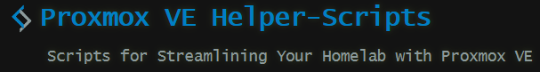
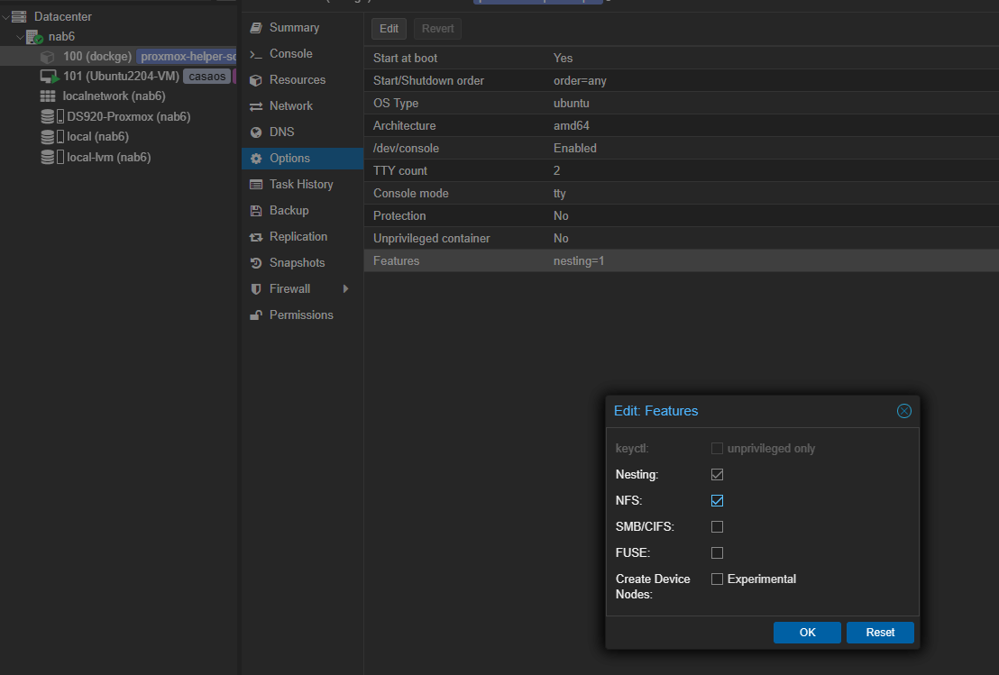
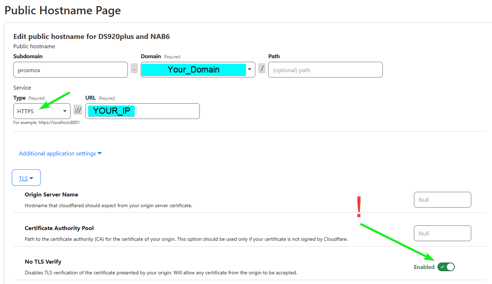

icon: simple/proxmox

# Proxmox


## Proxmox Helper Scripts
[](https://tteck.github.io/Proxmox/)


## Mounting NFS shares (NAS Shares)
  
in case you run a Proxmox CT container und need to give it access to NFS (and SMB if needed)
it need to be a priviliged container
(just doubleclick on `Features` and enable it on a stopped/Shutdown Container)




### Use my Script  
1. Go to home directory`cd ~`
2. create the [mount_nfs.sh](https://github.com/GSB-Deleven/mkdocs-material/blob/13f4f78b4cc5df7a144bb620dec7c818c5e2e076/docs/scripts-and-snippets/mount_nfs.sh) 
```sh
sudo nano mount_nfs.sh
```
3. copy the contents from [mount_nfs.sh](https://github.com/GSB-Deleven/mkdocs-material/blob/13f4f78b4cc5df7a144bb620dec7c818c5e2e076/docs/scripts-and-snippets/mount_nfs.sh) and ad it  
++ctrl+x++ :arrow_right: ++y++ :arrow_right: ++enter++ to save it
4. make it executable 
```sh
sudo chmod +x mount_nfs.sh
```
5. run it 
```sh
./mount_nfs.sh`
```


### Do it manually
If that didnt work, ChatGPT gave me this, and that worked always

1. **Update Package Lists:**
```sh
apt update && apt upgrade -y
```

2. **Install NFS Client:**
```sh
apt install -y nfs-common
```

3. **Create Mount Point:**
```sh
mkdir -p /mnt/DS920_docker # (1)!
```

      1. This command creates the directory `/mnt/DS920_docker`.  
      The `-p` flag ensures that the command doesn't throw an error if the directory already exists.

4. **Mount the NFS Share:**
```sh
mount -t nfs 192.168.1.222:/volume1/docker /mnt/DS920_docker # (1)!
```

      1. This command mounts the NFS share located at `192.168.1.222:/volume1/docker` to the local directory `/mnt/DS920_docker`.

5. **Check the Mount:**
```sh
df -h # (1)!
```

      1. Verifies that the NFS share is successfully mounted. You should see it listed among the mounted filesystems.

6. **Automount on Boot (Optional):**
   To ensure the NFS share is mounted automatically on system boot, add an entry to the `/etc/fstab` file. Open the file using a text editor (e.g., nano):
   
   ```sh
   nano /etc/fstab
   ```

   Add the following line at the end:
   ```text
   192.168.1.222:/volume1/docker /mnt/DS920_docker nfs defaults 0 0
   ```

   Save and exit the text editor.

7. **Unmount NFS Share (If Needed):**
   To unmount the NFS share, use the following command:
   ```sh
   umount /mnt/DS920_docker
   ```

Now, your Synology NAS NFS share should be successfully mounted to `/mnt/DS920_docker` on your Debian Proxmox CT. 
If you added an entry to `/etc/fstab`, the share will also be mounted automatically upon system boot.  

---

My `fstab` looks like this

```sh
# UNCONFIGURED FSTAB FOR BASE SYSTEM
192.168.1.115:/nfs/MediaHub_PR4100 /mnt/PR4100_MediaHUB nfs defaults 0 0
192.168.1.222:/volume1/docker /mnt/DS920_docker nfs defaults 0 0
```


## Access Proxmox via Cloudflare Tunnels

Make sure `No TLS Verify` is checked


## Grow File Size

Resize (add storage) in the Hardware Section, then

Hardware :arrow_right: Harddisk :arrow_right: Disk Action :arrow_right: Resize
  
Then open the console and type

```sh
sudo growpart /dev/sda 3
```

And then allocate it with

```sh
sudo resize2fs /dev/sda3
```
