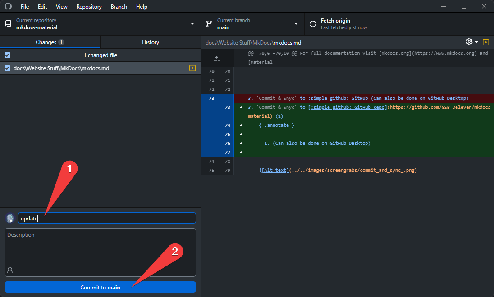
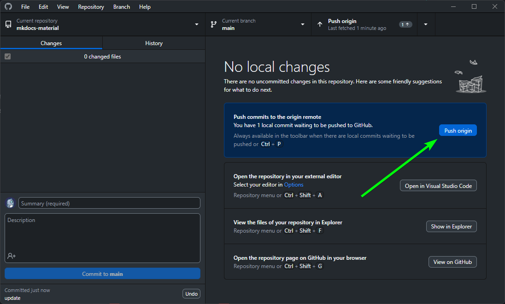
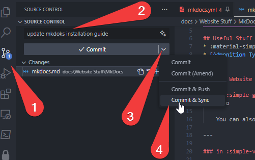

icon: simple/materialformkdocs
# MkDocs

For full documentation visit [mkdocs.org](https://www.mkdocs.org) and [Material for MkDocs](https://squidfunk.github.io/mkdocs-material/getting-started/).

## Useful Stuff
* :material-simple-icons: :fontawesome-solid-icons: [icon search](https://squidfunk.github.io/mkdocs-material/reference/icons-emojis/)
* [Admonition Types (Tips, Warnings, etc)](https://squidfunk.github.io/mkdocs-material/reference/admonitions/#supported-types)


## Edit Website

### in :simple-github: GitHub
!!! info

    You can also edit the page directly on github. Cloudflare Pages will update the Live Page after you commit the Changes

---

### in :simple-visualstudiocode: VS Code

1. Open Website in :material-microsoft-visual-studio-code: VS CODE

    !!! example "Open VSCode via Terminal"
        * Open Terminal
        * Navigate to you Site
            
            ```yaml
            cd X:\OneDrive\Documents\GitHub\mkdocs-material # (1)!
            ```
        
            1. Example

            open :simple-visualstudiocode: VS Code on this location with 
            

            ```yaml
            code . # (1)!
            ```

            1. minde the ++space++ between `code` and `.`


    !!! tip "Open VSCode via GitHub Desktop"
        I usually access it via :simple-github: GitHub Desktop

        


2.  Preview on http://localhost:8000/  
(Just type the following commands in the Terminal in VS Code)


    ```YAML title="Command"
    mkdocs serve
    ```

    ```YAML title="Expected Output" hl_lines="1"
    PS X:\OneDrive\Documents\GitHub\mkdocs-material> mkdocs serve # (1)!
    INFO    -  Building documentation...
    INFO    -  Cleaning site directory
    INFO    -  Documentation built in 0.44 seconds
    INFO    -  [20:07:01] Watching paths for changes: 'docs', 'mkdocs.yml'
    INFO    -  [20:07:01] Serving on http://127.0.0.1:8000/
    INFO    -  [20:07:03] Browser connected: http://localhost:8000/
    ```

    1.  This Command will run the live preview on http://localhost:8000/ , you can exit it with ++ctrl+c++ 

  
  
3. `Commit & Snyc` to [:simple-github: GitHub Repo](https://github.com/GSB-Deleven/mkdocs-material) (1)
    { .annotate }

      1. Can also be done on GitHub Desktop
          
        `Commit`
        
          
        `Push`
        


    
