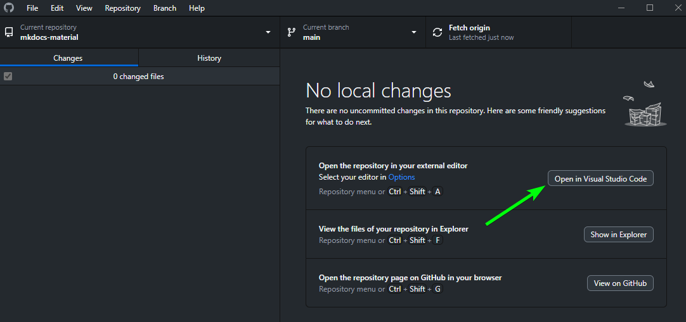

icon: simple/materialformkdocs
# Material for MkDocs

## Official Documentation
* **[:simple-materialformkdocs: Material for MkDocs](https://squidfunk.github.io/mkdocs-material/getting-started/)**

## Useful Stuff
* [:material-simple-icons: :fontawesome-solid-icons: icon search](https://squidfunk.github.io/mkdocs-material/reference/icons-emojis/) Reference
* [:fontawesome-solid-highlighter: Admonition Types (Tips, Warnings, etc)](https://squidfunk.github.io/mkdocs-material/reference/admonitions/#supported-types) Reference
* [:octicons-feed-plus-16: Annotations](https://squidfunk.github.io/mkdocs-material/reference/annotations/) Reference


## Edit Website

### in **[:simple-github: GitHub](https://github.com/GSB-Deleven/mkdocs-material)**
!!! info

    You can also edit the page directly on [:simple-github: GitHub](https://github.com/GSB-Deleven/mkdocs-material).  
    [**:simple-github: GitHub Actions**](https://squidfunk.github.io/mkdocs-material/publishing-your-site/#with-github-actions) will update the Live Page after you commit the Changes

---

### in :simple-visualstudiocode: VS Code

1. Open Website in :material-microsoft-visual-studio-code: VS CODE

    !!! example "Open VSCode via Terminal"
        * Open Terminal
        * Navigate to you Site
            
            ```yaml
            cd X:\OneDrive\Documents\GitHub\mkdocs-material # (1)!
            ```
        
            1. Example

            open :simple-visualstudiocode: VS Code on this location with 
            

            ```yaml
            code . # (1)!
            ```

            1. minde the ++space++ between `code` and `.`


    !!! tip "Open VSCode via GitHub Desktop"
        I usually access it via :simple-github: GitHub Desktop

        


2.  Preview on http://localhost:8000/  
(Just type the following commands in the Terminal in VS Code)


    ```YAML title="Command"
    mkdocs serve
    ```
    ??? info "Expected Output"
        ```YAML hl_lines="1"
        PS X:\OneDrive\Documents\GitHub\mkdocs-material> mkdocs serve # (1)!
        INFO    -  Building documentation...
        INFO    -  Cleaning site directory
        INFO    -  Documentation built in 0.44 seconds
        INFO    -  [20:07:01] Watching paths for changes: 'docs', 'mkdocs.yml'
        INFO    -  [20:07:01] Serving on http://127.0.0.1:8000/
        INFO    -  [20:07:03] Browser connected: http://localhost:8000/
        ```

        1.  This Command will run the live preview on http://localhost:8000/ , you can exit it with ++ctrl+c++ 

  
  
3. `Commit & Snyc` to [:simple-github: GitHub Repo](https://github.com/GSB-Deleven/mkdocs-material) (1)
    { .annotate }

      1. **Can also be done in :simple-github: GitHub Desktop**

        ---

        `Commit`

        

        ---

        `Push`

        

        ---


    


## Plugins

If you add Plugins, you need to add them in the `ci.yml` as well like this:

```yaml linenums="1" hl_lines="54-56"
# Set the name of the GitHub Actions workflow
name: ci

# Trigger the workflow on pushes to the specified branches
on:
  push:
    branches:
      - master
      - main

# Specify permissions for writing contents
permissions:
  contents: write

# Define the deploy job
jobs:
  deploy:
    # Run the job on the latest version of the Ubuntu environment
    runs-on: ubuntu-latest

    # List of steps to execute
    steps:
      # Step 1: Check out the repository at the specified version and fetch depth
      - uses: actions/checkout@v4
      - with:
          fetch-depth: 0

      # Step 2: Configure Git credentials for the workflow
      - name: Configure Git Credentials
        run: |
          git config user.name github-actions[bot]
          git config user.email 41898282+github-actions[bot]@users.noreply.github.com

      # Step 3: Set up Python with the specified version
      - uses: actions/setup-python@v4
        with:
          python-version: 3.x

      # Step 4: Set the cache_id environment variable using the current week number
      - run: echo "cache_id=$(date --utc '+%V')" >> $GITHUB_ENV

      # Step 5: Cache the installed dependencies to speed up future builds
      - uses: actions/cache@v3
        with:
          key: mkdocs-material-${{ env.cache_id }}
          path: .cache
          restore-keys: |
            mkdocs-material-

      # Step 6: Install the MkDocs Material theme
      - run: pip install mkdocs-material

      # Step 7: Install additional MkDocs plugins
      - run: pip install mkdocs-material mkdocs-git-revision-date-localized-plugin
      - run: pip install mkdocs-git-committers-plugin-2
      - run: pip install mkdocs-minify-plugin

      # Step 8: Set the custom domain by creating or overwriting the CNAME file
      - run: echo "docs.deleven.net" > CNAME

      # Step 9: Deploy the MkDocs site to GitHub Pages, forcing the update
      - run: mkdocs gh-deploy --force
```