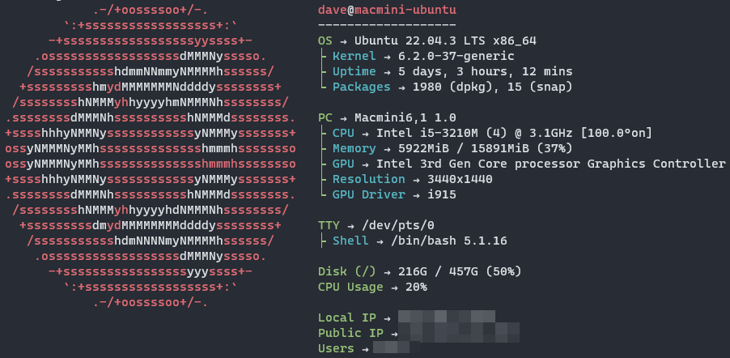

icon: material/home
# My HomeLab
  
## :bulb: Inspiration
Most of the inspiration comes from this guys here:  

  - [Awesome-Selfhosted Website](https://awesome-selfhosted.net/)  
  - [Awesome-Selfhosted GitHub](https://github.com/sindresorhus/awesome)  

## :fontawesome-solid-computer: Systems and other Hardware
I will List my Hardware here

-------------------------------------------------------------------------------------------------------------------------------------------------------------------

### NAB6 mini PC 

Main Server, High Power
  


-------------------------------------------------------------------------------------------------------------------------------------------------------------------


### Macmini Late 2012 

Second Server, Low Power



-------------------------------------------------------------------------------------------------------------------------------------------------------------------

### Raspberry Pi 4 

Pi-Hole and such


-------------------------------------------------------------------------------------------------------------------------------------------------------------------

## :simple-linux: Software

### OS
* :simple-proxmox: [Proxmox](Proxmox/proxmox.md)
* :material-ubuntu: Ubuntu
* :fontawesome-brands-debian: Debian

---

### Terminal stuff
#### Nala 
```sh
sudo apt install nala
```
??? abstract "Explanation"
    * is an alternative to `apt`
    * use 
    ```sh
    sudo nala update && sudo nala upgrade -yy
    ```
    instead of 
    ```sh
    sudo apt update && sudo apt upgrade -yy
    ```
#### neofetch
  * Shows your Systeminfo
??? abstract "Explanation"
    * See config here: [config.conf](https://github.com/GSB-Deleven/HomeLab/blob/429b4a9c5fb366ef10b661b865fa99e16d729e4f/Terminal%20configs/neofetch/config.conf)
    * My [.bashrc](https://github.com/GSB-Deleven/HomeLab/blob/429b4a9c5fb366ef10b661b865fa99e16d729e4f/Terminal%20configs/.bashrc)  runs this on every startup
---

### Docker Containers
* for the compose files see: [stacks](https://github.com/GSB-Deleven/HomeLab/tree/429b4a9c5fb366ef10b661b865fa99e16d729e4f/stacks)
<table>
    <tr>
        <th>Logo</th>
        <th>Name</th>
        <th>Description</th>
        <th>Install Method</th>
    </tr>
    <tr>
        <td></td>
        <td><a href="https://github.com/louislam/dockge" target="_blank">Dockge</a></td>
        <td>Docker Compose Management</td>
        <td><a href="https://tteck.github.io/Proxmox/" target="_blank">Proxmox LXC via Helper Script</a></td>
    </tr>
    <tr>
        <td></td>
        <td><a href="https://casaos.io/" target="_blank">CasaOS</a></td>
        <td>Manages also Docker Containers and has great <a href="https://awesome.casaos.io/content/3rd-party-app-stores/list.html" target="_blank">Custom Appstores</a></td>
        <td><a href="https://casaos.io/" target="_blank">CasaOS Install Script</a></td>
    </tr>
