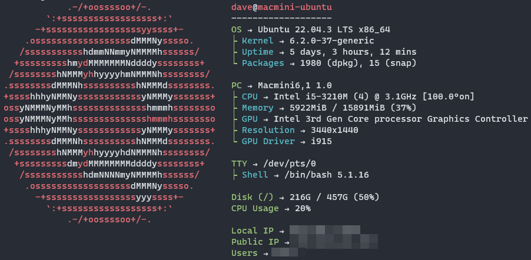
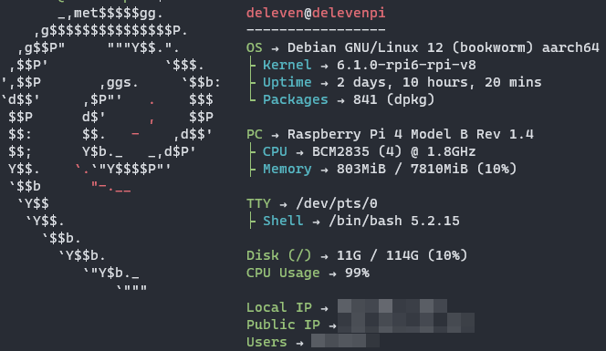

## :bulb: Inspiration

Most of the inspiration comes from this guys here:

- [Awesome-Selfhosted Website](https://awesome-selfhosted.net/)
- [Awesome-Selfhosted GitHub](https://github.com/sindresorhus/awesome)

## :fontawesome-solid-computer: Systems and other Hardware

I will List my Hardware here

---

### NAB6 mini PC

Main Server, High Power


---

### Macmini Late 2012

Second Server, Low Power



---

### Raspberry Pi 4

Pi-Hole and such



---

## :simple-linux: Software

### OS

- :simple-proxmox: [Proxmox](Proxmox/proxmox.md)
- :material-ubuntu: Ubuntu
- :fontawesome-brands-debian: Debian

---

### Terminal stuff

#### Nala

```sh
sudo apt install nala
```

??? abstract "Explanation"

    is an alternative to `apt`
    use
    ```sh
    sudo nala update && sudo nala upgrade -yy
    ```
    instead of
    ```sh
    sudo apt update && sudo apt upgrade -yy
    ```

#### neofetch

```sh
sudo nala install neofetch
```

- Shows your Systeminfo

??? Question "configs"
  
    See config here: [config.conf](https://github.com/GSB-Deleven/mkdocs-material/blob/0b45d6baf28cf150ab4ad99ee6ab3b6e056b1228/docs/scripts-and-snippets/neofetch/config.conf)  
    [README.md](https://github.com/GSB-Deleven/mkdocs-material/tree/0b45d6baf28cf150ab4ad99ee6ab3b6e056b1228/docs/scripts-and-snippets/neofetch)  
    My [.bashrc](https://github.com/GSB-Deleven/mkdocs-material/blob/0b45d6baf28cf150ab4ad99ee6ab3b6e056b1228/docs/scripts-and-snippets/bashrc/.bashrc) runs this on every startup  

---

### Docker Containers

!!! tip "GitHub"

    for the compose files see: [docker-compose files](https://github.com/GSB-Deleven/mkdocs-material/tree/main/docs/scripts-and-snippets/docker-compose%20files) in the [:simple-github: GitHub Repo](https://github.com/GSB-Deleven/mkdocs-material/tree/main/docs/scripts-and-snippets/docker-compose%20files)

#### Table

| Name              |                     | Description              | Location                                                                                                                                                                                                                    |
| :---------------- | :-----------------: | :----------------------- | :-------------------------------------------------------------------------------------------------------------------------------------------------------------------------------------------------------------------------- |
| `arr-stack.yml`   |    :pirate_flag:    | downloading and stuff... | [docs/scripts-and-snippets/docker-compose files/arr-stack-yml](https://github.com/GSB-Deleven/mkdocs-material/blob/d251b81977da12608bfb2521e7bed810b58781b8/docs/scripts-and-snippets/docker-compose%20files/arr-stack.yml) |
| `cloudflared.yml` | :simple-cloudflare: | Cloudflared DDNS updater | [docs/scripts-and-snippets/docker-compose files/cloudflared.yml](https://github.com/GSB-Deleven/mkdocs-material/blob/eb9e027cb8cc2e70420650228304b533a504806a/docs/scripts-and-snippets/docker-compose%20files/cloudflared.yml)                                        |
